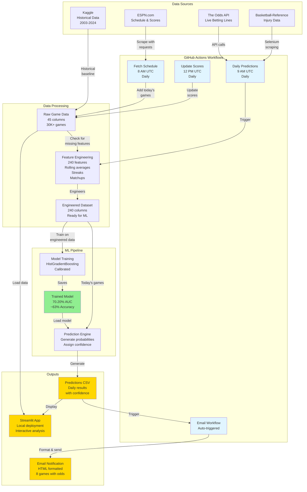

# NBA Prediction System Architecture

## System Overview



## Data Flow Details

### 1. Data Collection (Daily 8:00 AM UTC)
**Workflow:** `fetch-todays-schedule-v2.yml`

```
ESPN.com → BeautifulSoup → Parse Schedule → Add to Dataset → Commit
```

**Output:** 8-15 new games added to `games_with_real_vegas_workflow.csv`

---

### 2. Prediction Generation (Daily 9:00 AM UTC)
**Workflow:** `daily-predictions-v4-FORCE-NEW.yml`

```
Load Dataset (45 cols)
    ↓
Check for Missing Features
    ↓ (detects new games have no features)
Feature Engineering (2-3 min)
    ↓
    • Process games consecutively
    • Calculate rolling averages (3, 5, 7, 10, 15 games)
    • Compute win/loss streaks
    • Add head-to-head matchup features
    • Calculate league average comparisons
    • Add injury features (19 features)
    • Add Vegas odds features (spread, total, moneyline)
    ↓
Engineered Dataset (240 cols)
    ↓
Model Training (2-3 min)
    ↓
    • HistGradientBoostingClassifier
    • Calibrate probabilities (CalibratedClassifierCV)
    • Test accuracy: ~63%
    ↓
Trained Model (saved)
    ↓
Load Today's Games
    ↓
Make Predictions
    ↓
    • 8 games with probabilities
    • Assign confidence (High/Med/Low)
    • Format matchups
    ↓
Save Predictions CSV
    ↓
Commit to GitHub
    ↓
Trigger Email Workflow
```

**Output:** `predictions_latest.csv` with varied predictions (27%-71%)

---

### 3. Score Updates (Daily 12:00 PM UTC)
**Workflow:** `update-completed-scores.yml`

```
ESPN Scoreboard → Scrape Results → Match Games → Update Dataset
                                          ↓
                                    PTS_home, PTS_away
                                    HOME_TEAM_WINS
                                          ↓
                                   Commit to GitHub
```

**Output:** Updated `games_with_real_vegas_workflow.csv` with completed scores

---

### 4. Email Notifications (Auto-triggered)
**Workflow:** `email-daily-predictions-v2.yml`

```
Load predictions_latest.csv
    ↓
Format HTML Email
    ↓
    • Game matchups
    • Win probabilities
    • Predicted winners
    • Confidence levels
    • Vegas odds (spread, O/U, ML)
    ↓
Send via SMTP (Gmail)
```

**Output:** Formatted email with 8 predictions

---

## Feature Engineering Pipeline

### Input Features (45 columns)
- Basic game data: date, teams, scores
- Vegas odds: spread, total, moneyline
- Injury counts: active injuries, severity
- Metadata: season, game ID

### Feature Engineering Process

**Step 1: Process Games Consecutively**
```
Each game → Split into 2 rows (home team perspective + away team perspective)
30,137 games → 60,274 rows
```

**Step 2: Calculate Rolling Statistics**
- **Time windows:** Last 3, 5, 7, 10, 15 games
- **Metrics:** Points, FG%, FT%, 3P%, AST, REB, Wins
- **Perspectives:** Home games only, Away games only, All games
- **Result:** ~150 rolling average columns

**Step 3: Compute Streaks**
- Win/loss streaks
- Home/away streaks
- Matchup-specific streaks
- **Result:** ~10 streak columns

**Step 4: Head-to-Head Matchups**
- Historical performance vs specific opponent
- Rolling averages for matchup
- **Result:** ~30 matchup columns

**Step 5: League Average Comparisons**
- Team stat - League average stat
- Identifies above/below average performance
- **Result:** ~40 comparison columns

**Step 6: Merge Home & Visitor Features**
- Combine features for both teams in each game
- Append `_x` suffix for home team
- Append `_y` suffix for visitor team
- Drop duplicate columns
- **Result:** 240 total columns

### Output Features (240 columns)
- 190 rolling average features
- 19 injury features
- 10 streak features
- 10 Vegas odds features
- 11 basic features (date, teams, etc.)

---

## Model Architecture

### HistGradientBoostingClassifier
```python
HistGradientBoostingClassifier(
    learning_rate=0.05,
    max_iter=500,
    max_depth=5,
    random_state=42
)
```

**Wrapped in:** `CalibratedClassifierCV`
- **Method:** Sigmoid calibration
- **Purpose:** Ensures predicted probabilities match true probabilities
- **Result:** Reliable confidence levels

### Training Details
- **Training data:** 25,000+ historical games
- **Validation data:** Most recent season
- **Features used:** 220-240 (after dropping unnecessary columns)
- **Training time:** 2-3 minutes
- **Model size:** ~3 MB

### Performance Metrics
| Metric | Value |
|--------|-------|
| **AUC-ROC** | **70.20%** |
| **Accuracy** | **~63%** |
| **Log Loss** | ~0.65 |
| **Brier Score** | ~0.23 |

### Prediction Confidence Assignment
```python
if abs(probability - 0.5) > 0.15:  # >65% or <35%
    confidence = "High"
elif abs(probability - 0.5) > 0.08:  # 58-65% or 35-42%
    confidence = "Medium"
else:
    confidence = "Low"
```

---

## Deployment Architecture

### GitHub Actions (Compute)
- **Platform:** GitHub hosted runners (Ubuntu)
- **Python:** 3.11
- **Memory:** 7 GB
- **Storage:** 14 GB SSD
- **Cost:** Free (public repository)

### Data Storage
- **Repository:** GitHub (direct commits)
- **Dataset:** `games_with_real_vegas_workflow.csv` (93 MB → slimmed to 6 MB for workflows)
- **Predictions:** `data/predictions/` directory
- **Model:** Generated fresh each run (not stored in Git)

### Local Development
- **Streamlit App:** Runs locally on port 8501
- **Full Dataset:** 93 MB with all engineered features
- **Model Cache:** Saved locally for faster testing

---

## System Monitoring

### Data Freshness Indicators (Streamlit App)
```
🎲 Live Odds: Nov 17, 08:32 AM
🏥 Injuries: Nov 17, 08:32 AM
📊 Data: Nov 13, 04:50 PM
```

### Workflow Status
View at: `https://github.com/[user]/bball-prediction/actions`

- ✅ Green: Success
- ❌ Red: Failed
- 🟡 Yellow: Running

### Email Notifications
- **Sent:** After successful predictions
- **Includes:** 8 games with varied predictions
- **Format:** HTML table with confidence indicators

---

## Error Handling

### Feature Engineering Failures
```python
try:
    df = process_features(df)
except MergeError:
    # Drop duplicate columns and retry
    df = drop_duplicates_before_merge(df)
```

### Model Loading
```python
if model_not_found():
    # Retrain automatically
    model = train_new_model()
elif model_invalid():
    # Retrain if corrupted
    model = train_new_model()
```

### Workflow Failures
- **Retry:** Automatic retry on transient failures
- **Notification:** GitHub sends email on workflow failure
- **Fallback:** Can manually trigger workflows

---

## Performance Optimizations

### 1. Slim Dataset for Workflows
- **Problem:** 93 MB dataset too large for Git
- **Solution:** Store 45 columns (6 MB), engineer on-demand
- **Benefit:** Fast checkout, reliable commits

### 2. Feature Engineering Cache
- **Check:** If features exist, skip re-engineering
- **Trigger:** If ANY game missing features → re-engineer all
- **Benefit:** 2-3 min saved when features up-to-date

### 3. Model Retraining
- **When:** Only when model doesn't exist
- **Why:** Fresh model always uses latest feature set
- **Benefit:** No feature mismatch errors

### 4. Parallel Data Loading
- **Streamlit:** Loads full dataset (93 MB)
- **Workflows:** Load slim dataset (6 MB)
- **Benefit:** Fast local dev, reliable workflows

---

## Future Architecture Improvements

### Potential Enhancements
1. **Cloud Database:** Move from CSV to PostgreSQL/MongoDB
2. **Redis Cache:** Cache engineered features for faster predictions
3. **Docker:** Containerize for consistent environment
4. **API Endpoint:** REST API for predictions (FastAPI)
5. **Real-time Updates:** WebSocket for live odds updates
6. **Model Registry:** MLflow for model versioning
7. **A/B Testing:** Compare multiple models in production
8. **Monitoring:** Prometheus + Grafana for metrics

### Scalability Considerations
- **Current:** 30K games, 240 features, 3 MB model
- **Limit:** GitHub Actions 6 hour timeout
- **Current Runtime:** ~7 minutes end-to-end
- **Headroom:** 51x current capacity

---

## Technology Stack

### Languages & Frameworks
- **Python 3.11**
- **Pandas** - Data manipulation
- **Scikit-learn** - ML models & calibration
- **Streamlit** - Web interface

### Data Collection
- **Requests + BeautifulSoup** - ESPN scraping
- **Selenium + ChromeDriver** - Basketball-Reference scraping
- **The Odds API** - Live betting lines

### ML Libraries
- **Scikit-learn** - HistGradientBoosting, Calibration
- **XGBoost** - Alternative model
- **LightGBM** - Alternative model
- **CatBoost** - Alternative model

### Infrastructure
- **GitHub Actions** - CI/CD & scheduled workflows
- **Gmail SMTP** - Email notifications
- **Git** - Version control & data storage

### Development Tools
- **Cursor AI** - AI-powered development
- **VS Code** - IDE
- **Jupyter** - Exploratory analysis
- **Git** - Version control

---

## Quick Reference

### Key Files
```
├── data/
│   ├── games_with_real_vegas_workflow.csv    # Main dataset (6 MB slim)
│   ├── predictions/predictions_latest.csv     # Latest predictions
│   └── games_streamlit_sample.csv             # Sample for testing
├── models/
│   └── histgradient_vegas_calibrated.pkl      # Trained model (local only)
├── scripts/
│   ├── predictions/
│   │   ├── make_daily_predictions.py          # Main prediction script
│   │   └── setup_model.py                     # Model training
│   └── data_collection/
│       ├── fetch_todays_schedule.py           # ESPN scraper
│       └── update_completed_scores.py         # Score updater
├── src/
│   ├── feature_engineering.py                 # Feature engineering (240 cols)
│   └── streamlit_app_enhanced.py              # Streamlit app
└── .github/workflows/
    ├── daily-predictions-v4-FORCE-NEW.yml     # Main workflow
    ├── fetch-todays-schedule-v2.yml           # Schedule fetch
    ├── update-completed-scores.yml            # Score updates
    └── email-daily-predictions-v2.yml         # Email sender
```

### Key Metrics
- **Dataset:** 30,137 games (2003-2025)
- **Features:** 240 engineered features
- **Model:** HistGradientBoosting + Calibration
- **AUC:** 70.20%
- **Accuracy:** ~63%
- **Runtime:** ~7 minutes end-to-end
- **Daily Games:** 8-15 games
- **Automation:** 4 workflows

---

**Last Updated:** November 2025

